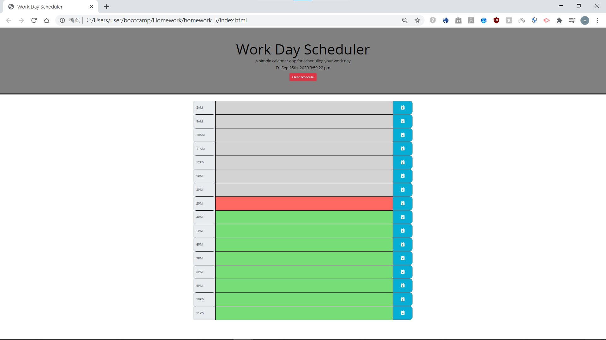
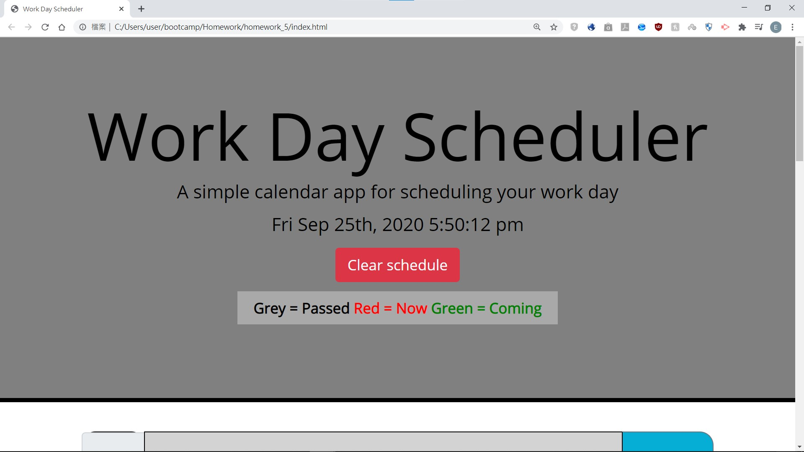
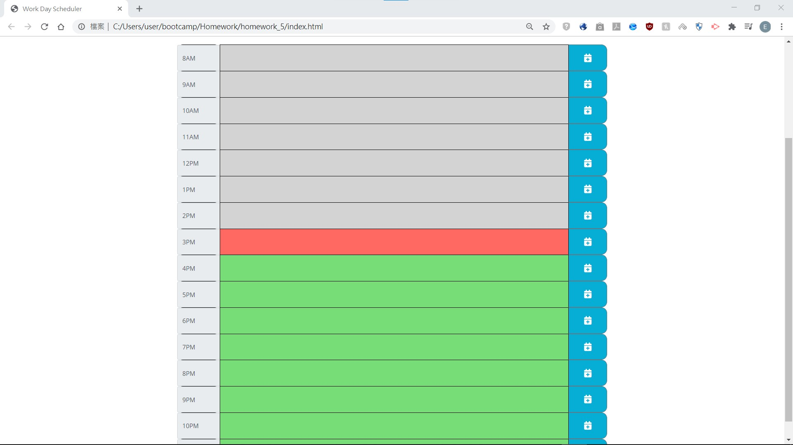
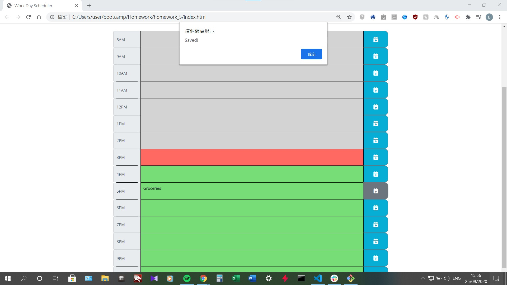

# Day-Planner
Goal: To make a day planner that can store the schedule locally and can be retrieved after reloading the page.
This project has the following abilities:
- Able to display current time, date, month, year and day of week
- Time slots are color-coded to represent past/present/future
- Previous entry (description) of each time slot is saved using localStorage and is retrieved when the page is loaded
- New entries (descriptions) can be saved to localStorage using a save button
- Able to clear the schedule on screen as well as in localStorage when "Clear schedule" button is pressed

 

This project contains the following:
- index.html: General page structure
- script.js: Builds the schedule (16 rows) with appropriate color; Create localStorage for entry of each time slot if no records were found in localStorge. If there is a record, it will be loaded into the schedule.
- style.css: General styling for index.html

 

This project is built using: **HTML5**, **CSS**, **Bootstrap**, **Javascript**, **jQuery** and **moment.js**.
This project is currently hosted on Github Pages:

## script.js
- Insert a clock displaying current time on load using **moment.js**
- Build the schedule with 16 time slots and color coding on load using **HTML5** and **jQuery**
- Save all entries/descriptions (if it is not null) from all time slots into browser using **localStorage**
- Clear all stored descriptions when "Clear schedule" is pressed using **Javascript**

### Overview

### Header with clock displaying current time

### Color-coded time slots

### Saving entry/description of respective time slots

